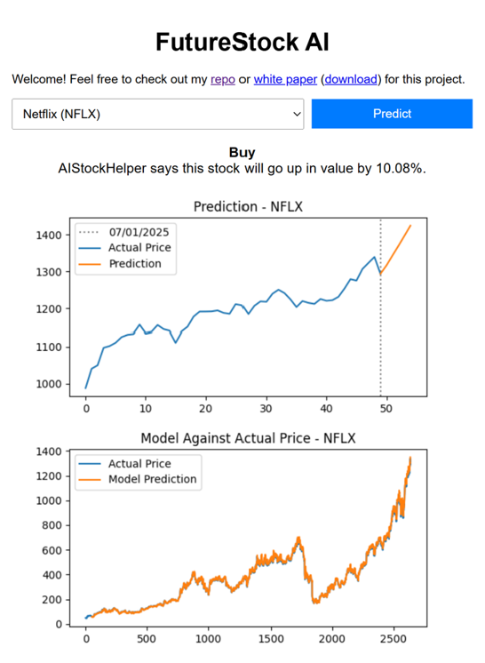

# FutureStock AI

A Flask-based LSTM application that predicts future stock prices for selected tickers.



## Description

This application trains LSTM models on selected stock tickers and continuously updates them. With every new closing price, the app loads a pre-trained model from an SQLite database. If the market has closed since the last prediction, the model is updated, a new prediction is generated, and both are saved. Results include formatted text and visualizations.

> **Note:** This is a portfolio project demonstrating AI integration and should not be interpreted as financial advice.

## Getting Started

### Dependencies

* Python 3
* `requirements.txt` includes all necessary packages such as Flask, TensorFlow, Pandas, etc.

### Installing

* Install git, python3, python3-pip, pip3 as needed
* Clone the project to your desired directory
* Create the virtual environment. Go into the project folder and run:
``` 
python3 -m venv venv
source venv/bin/activate
pip install -r requirements.txt
```

### Executing program

* Open a terminal to the root directory
* To run the app in development mode:
``` 
python app.py
```
This will launch the app locally at `http://127.0.0.1:5000/`.


## Help

* For a basic walkthrough, see my [Jupyter Notebook Version](https://colab.research.google.com/drive/1z96VjkJXcIOQ6KdNjEPjhmxKKfLd7FLH).
* The app starts fresh when `model.db` is deleted: `static/models/model.db`.
* To tweak performance or accuracy, adjust the global variables in `model/lstm_model.py`. For example, lowering `epochs` speeds up training but reduces accuracy.

## Author

**Wess Lancaster**  
[LinkedIn ↗](https://linkedin.com/in/wessbl)  
wess.lancaster@gmail.com

## Version History
* 0.6
    * Program has an updater file that can be run by a service automatically
    * Users no longer need to wait for a model to train
    * Models are now stored with a status for update handling
    * If user accesses a ticker during an update a message is displayed above the older results
    * Removed browser caching to ensure that the latest prediction is always shown
    * Added basic formatting for prediction message (bold and new line)
    * Removed "Not loading?" Message
    * See [commit change](https://github.com/wessbl/wbl-aistocks/commit/2406748f5aac82f328ce579fc554bb37e5ea3610)
* 0.5
    * Images now resize with smaller screens/windows
    * Added white paper and repo links
    * Added hideable "Not loading?" message
    * Decreased prediction length due to slow server response
    * See [commit change](https://github.com/wessbl/wbl-aistocks/commit/5740fac657a7a16181d3a19ea7f43b089d096ad2)
* 0.4
    * Squashed bug that prevented model updates
    * Added db_interface.py - currently only for admin operations
    * Directory cleanup
    * See [commit change](https://github.com/wessbl/wbl-aistocks/commit/22f1e557d6ba796af350a90c0b23e42befec3ae0)
* 0.3
    * General directory cleanup, removal of debug prints
    * Lowered epochs due to slow server response
    * See [commit change](https://github.com/wessbl/wbl-aistocks/commit/678685f3d3f6fe2298b1375f311f48b0a9492b44)
* 0.2
    * All models held in a dictionary for immediate response time
    * Constant prediction & image generation prevented
    * Wrapper class added around lstm_model.py
    * See [commit change](https://github.com/wessbl/wbl-aistocks/commit/2fb715f51e4b70cdd910bbfd11f17d2433b050c5)
* 0.1
    * Initial Release